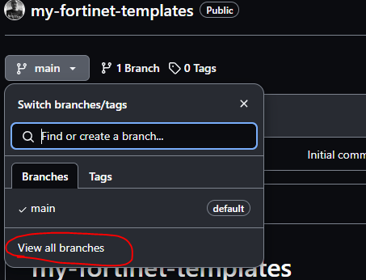

# GitHub repository setup

This section is about how to set up a GitHub Enterprise repository for holding the template data and how to support
certain requirement needed for proper development workflow.

The following sections are leading step by step through the procedure of creating a repository, but there is a template
one created for testing the tool: [fmgsync-test](https://github.com/realvitya/fmgsync-test)

## Creating repository

!!! inline tip end

    It is advisable not to use default branch name **main** but rename it to **production** and have a permanent
    **acceptance** branch for the integration tests. It is possible later to merge working branches to acceptance and
    later acceptance to the production. Rename it as soon as possible to avoid problems later when others started
    using **main** and it just disappear for them!

When a repository is created for the first time, it does not have any files in it. In this state, the sync tool cannot
use the repository. In order to start working with the tool, first the template directory structure must be created.

It is also recommended to allow GitHub to create a README file for us. This way we have a minimal documentation
possibility, plus we have at least one file in the repository already.


### Renaming default branch




### Repo settings

After renaming the default branch, certain settings may be configured to form our repository to our needs. Such settings
are to disable not required features like Wiki, Projects. All depends on the needs.

Collaborators also need to set up! Usually a team need to be added as collaborator where all the people will have
access to the repository to do the actual teamwork of developing and reviewing.

It is highly advisable to configure `Rules` which will protect **production** and **acceptance** branches from direct
push changes and enforcing users to use Pull requests in order to apply changes to those branches. Example of such a
ruleset:


## Folder structure

This is a basic folder structure with all mandatory folder names. These are picked up by the sync tool and GitHub. Any
other folder is optional and allowed. Those are ignored by the tool. Adding extra information, files or folders might
be necessary if the repository is used by other tools as well. (For example Nautobot compliance tool)

``` text
fmgsync-repo
|
│   README.md
│
├───.github
│   │   pull_request_template.md
│   │
│   └───workflows
│           jinja-linter.yml
│
├───pre-run
│       test_FG101F-init.j2
│
├───template-groups
│       test_global.j2
│
└───templates
        test_banner.j2
        test_default-gw.j2
        test_dns.j2

```

All Jinja2 templates have to have the `.j2` extension! More details can be found be the
[repository setup section](../user_guide/repository.md#template-format).

### Setting up actions

Actions define workflows to do on certain trigger events. These workflows run on - so called - GitHub runners.
These can run on the GitHub server directly, or the runner can be installed locally and those are called **self-hosted**
runners. Most probably self-hosted runner will be needed as the runner needs to access the FMG API interface.
It's easier to configure firewall rules, FMG user source restriction if the IP address of the runner is known.
If the FMG is in the cloud, the runner also need to be there if otherwise the connectivity is impossible.

Some basic example can be found in the [GitHub actions section](github_actions.md).

### Configure Pull Request template

PR template is useful to present a standard form to the users to fill while submitting their pull requests.

Here is a very basic example:

```markdown title=".github/pull_request_template.md"
Change ticket: CHGXXXXXXX

Reason of this change:
```

## Documentation

The root folder of the repository should have a **README.md** file which should serve as a documentation for the users.
It may contain the procedures and rules to follow. It is displayed on the main page of the repository on GitHub. The
default .md file is a
[Markdown](https://docs.github.com/en/get-started/writing-on-github/getting-started-with-writing-and-formatting-on-github/basic-writing-and-formatting-syntax)
file, it's possible to use formatting and enhancing the look of it.
