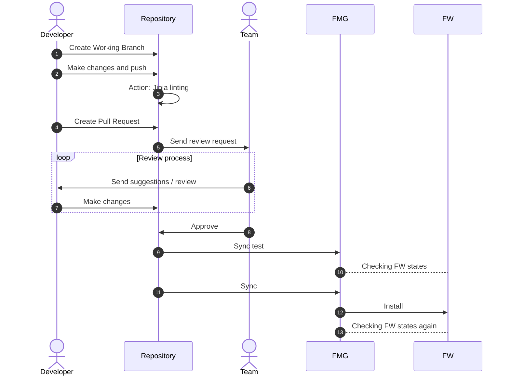
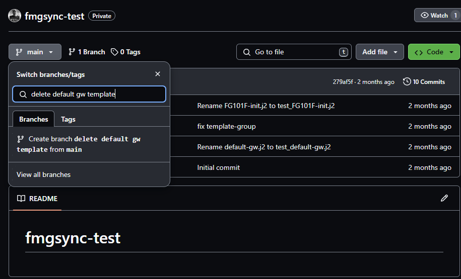
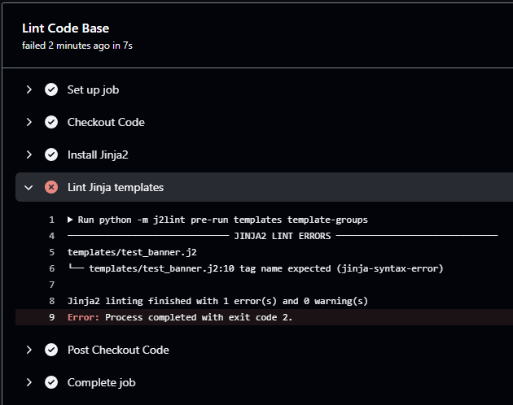
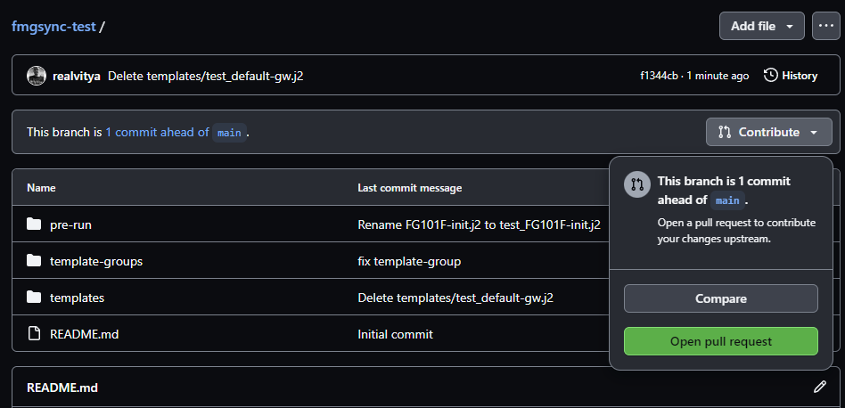
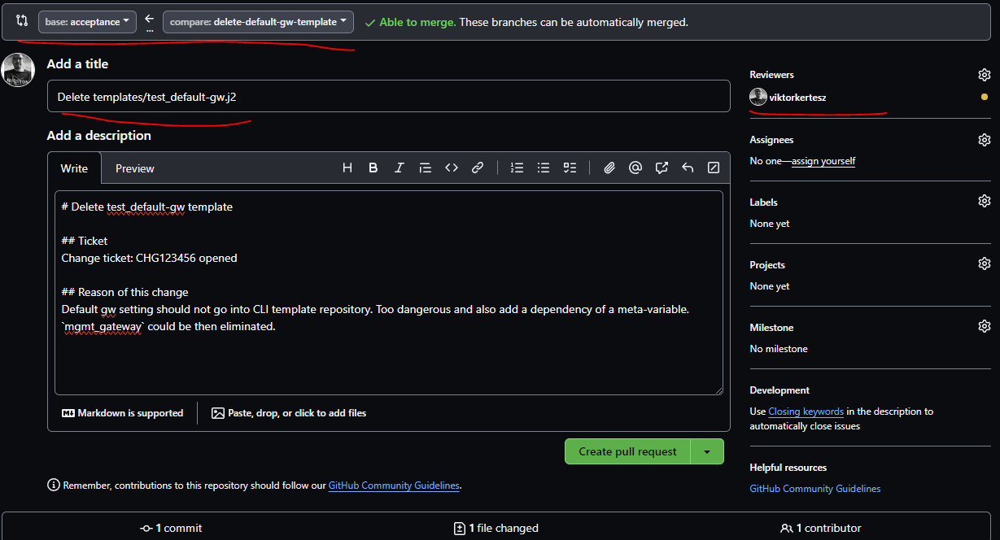
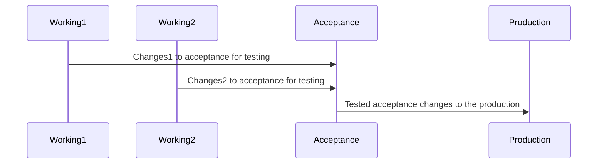
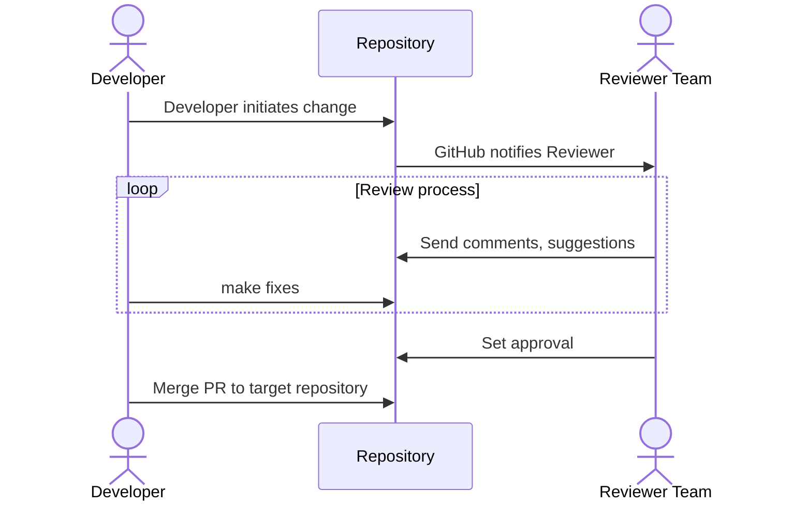
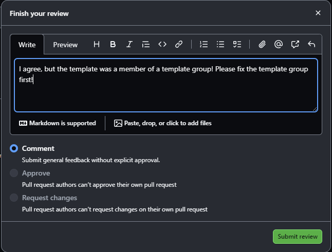
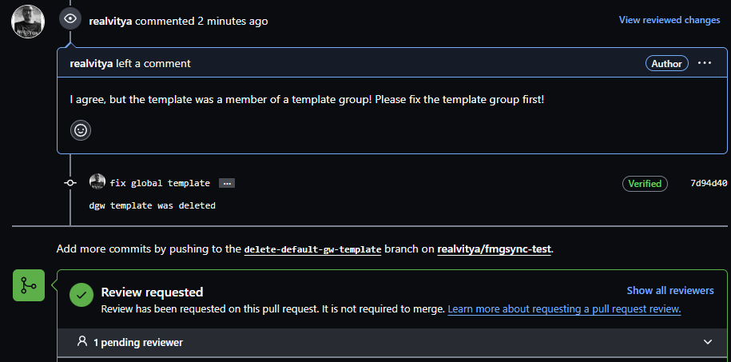
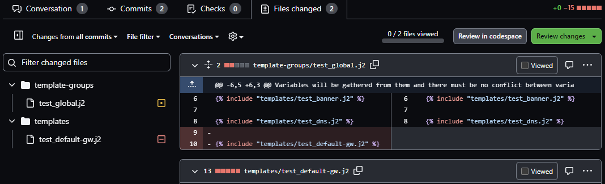

# Developing templates

This section tries to describe how an organization can use teamwork to meet the following requirements:

* Syntactically correct and standard formatted Jinja templates
* review and approval process
* testing in acceptance
* Merging changes to production

The steps needed to achieve the goal:

## Create working branch for change

The branch name should reflect the change purpose or any relevant business process. It shouldn't be too general, like
"My change".

!!! Note

    Git branching is a way of parallel working of a state and later it is possible to merge these changes back to the
    original. The default branch is named 'main' or 'master'. These shouldn't be used in the template repo though.

Example of creating a working branch:

## Syntax checking

Templates updated need preliminary testing to check syntax and indicate non-compliant Jinja documents. It's important
to ensure template standard and correctness.

This check is done by [GitHub action](github_actions.md#jinja2-linting) which triggers by pushing changes to a branch.

## Create Pull Request

This step is necessary to notify other reviewers to check the changes.

!!! Tip

    Create a Pull request template in GitHub so all necessary information will be pre-filled automatically by GitHub.
    More details on [official GitHub docs](https://docs.github.com/en/communities/using-templates-to-encourage-useful-issues-and-pull-requests/creating-a-pull-request-template-for-your-repository).

### Opening PR

Example of opening a Pull Request:

### Fill in PR details

Then fill in the required information:

It's important to select the appropriate source and destination branches at the top. In this case, the new working
branch **delete-default-gw-template** will be merged back to **acceptance**. This is to ensure we touch the
**acceptance** system first, and when the change went well with all the testing, there would be another PR which then
would go from **acceptance** to **production**. Not all **acceptance** changes may go individually to the
**production**, it may be desirable to collect a set of changes, test them separately and a batch PR could go to the
**production**:

Reviewers is also important, it must be set to people of group of people who has right to review, suggest and approve
changes in the repository. Most probably these people are a team of more experienced staff about the device templates.

## Review

This is basically a 4-eye checking phase.
This phase can last for long, especially if the change is complex and might require additional testing in lab or
consultation with experts. Covering all GitHub features around Reviewing is not in the scope of this document.
You can find more information at [GitHub code review feature intro](https://github.com/features/code-review).

Workflow:

A basic review response is like that:

In this case, we may choose the `Request changes` button and do not let the requestor to go ahead with merging.

All changes in the working branch `delete-default-gw-template` will be listed on the PR. Let's say the requestor fixed
the issue:

Now new review is needed. Reviewer can check the result of all changes by the files section:

Now it looks good, change can be approved and requestor can merge it back to **acceptance**.

## Testing

If GitHub action was assigned to Pull Requests, those will run whenever the source branch changes. This is to keep the
state constantly up to date. If a change would cause an issue, the PR merge will be blocked until the issue is not
fixed.

## Merging pull request

It is advisable to use merge with squashing. It means that the repository won't keep history of individual changes of
the working branch but it will squash them into one single change. In the **production** and **acceptance** branches
only the PR merge will be seen in the history.

## Sync changes to FMG

This can be done either manually on a console or by GitHub action. CLI log output can be found in the
[User Guide](../user_guide/quickstart.md#sync) section.

Basic action to do such a sync can be found in the [Creating Actions](github_actions.md) section.

## Deploy changes to devices

When all actions are successful, a final step is to install the new CLI templates to the devices.
[User Guide](../user_guide/quickstart.md#deploy) show example output for such a run. Even deploy job will do initial
checks and looks for devices which requires the installation. Not all device in the automation group may be in scope
for installation. It all depends on the assignment of those templates.
