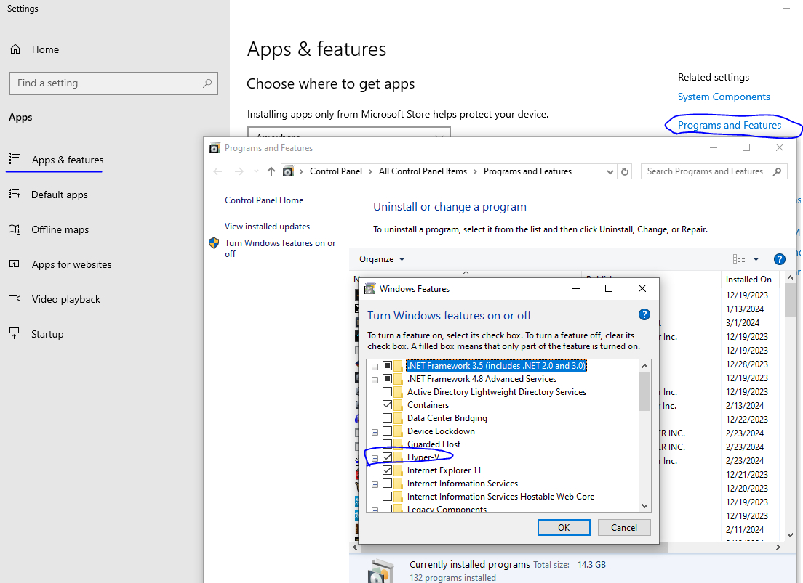

# Lab setup guide

## Installing FMG and FG

There are many options to create a lab and run Fortimanager either physically or virtually. The following method is only
one way of doing it easily.

### Install HyperV feature under Win10/11

### Install and configure VMs

Please follow the official documentation!
[Deploying FMG VM on Hyper-V](http://docs.fortinet.com/document/fortimanager-private-cloud/6.0.0/fortimanager-vm-on-hyper-v/121873/deploying-fortimanager-vm-on-hyper-v)

!!! Note

    For network access, there is the mentioned option to bridge it to real NIC or use internal network like the one
    provided by [WSL](https://learn.microsoft.com/en-us/windows/wsl/install). Goal is to have GUI access from the
    desktop.

After FMG, please install at least one device like a FortiGate.
[Deploy FortiGate VM in Hyper-V on Windows 10](https://community.fortinet.com/t5/FortiGate-Cloud/Technical-Tip-Deploy-FortiGate-VM-in-Hyper-V-on-Windows-10/ta-p/224803)

### Licensing

Easiest way is to provide Internet access to the VM and have at least an evaluation license ready.

You can follow the procedure to register the VM:
[Registering your Fortimanager VM](http://docs.fortinet.com/document/fortimanager-private-cloud/6.0.0/fortimanager-vm-on-hyper-v/179372/registering-your-fortimanager-vm)

FortiGate license is easier as you can have one free eval license per account. Use that for the new VM!

## FMG minimum configuration

It is advisable not to use the SuperAdmin profile for this automation. The minimum required admin profile settings are:

### Admin profile

Create an admin profile for the automation user as below:

* System Settings (Read-Only)
* Device Manager (Read-Write all)
* Policy & Objects (Read-Write all)
* Install Policy Package or Device Configuration (Read-Write)

If you use Workspace mode, you may add the followings too:

* Lock/Unlock ADOM (Read-Write)
* Lock/Unlock Device/Policy Package (Read-Write)

### Admin user

Create a user with the above profile and enable JSON RW access!

!!! Note

    Currently, the underlying `pyfortinet` library does not support any other authentication method than user/pass.
    You cannot use token or SAML authentication at the moment.

### Create a group for the devices

This group will be used to check and monitor device status. The tool won't deploy changes to firewalls which are not
member of this group. Though the tool can update CLI templates which are assigned to other firewalls, the intention
with this group is to only deploy these changes to firewalls which are in production and not under
staging/troubleshooting/etc., where a deployment would interfere with others.

!!! Tip

    Do not assign provision templates or template groups to this group! This group is to indicate which device to keep 
    track by this tool.
